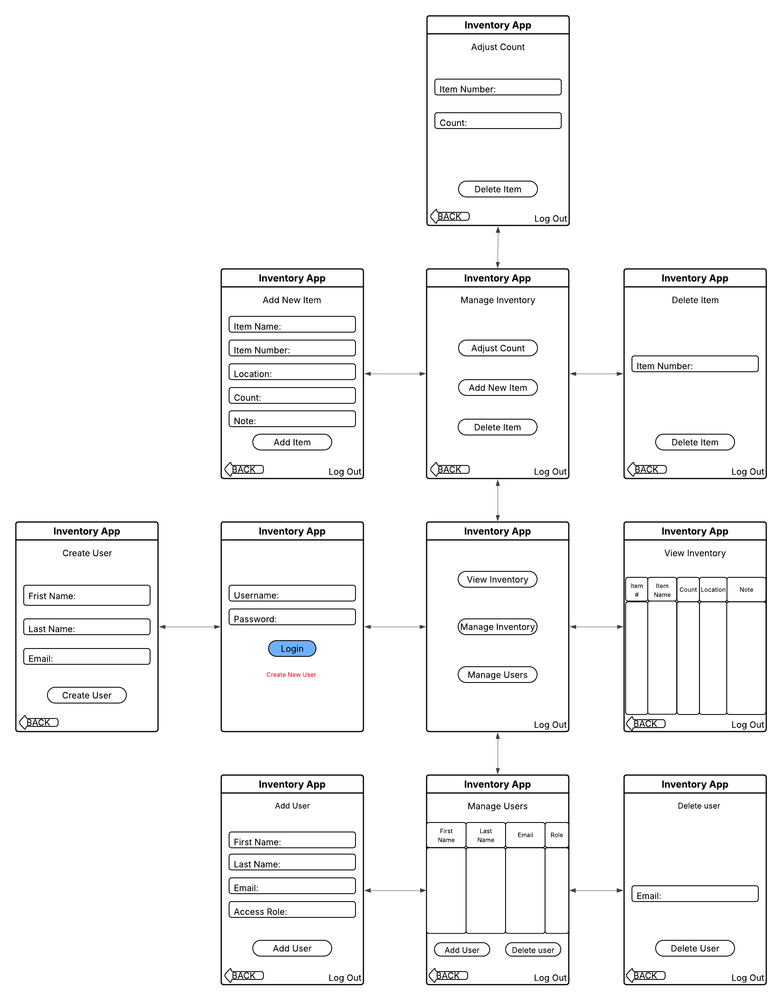
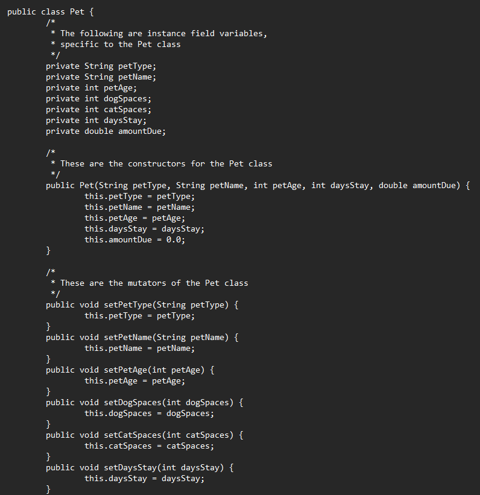
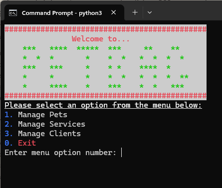

<!-- https://github.com/NicholasShaner/CS499_CompSciCapstone -->
<!--# CS499_CompSciCapstone-->

    

        <h1>CS-499 Profession e-Portfolio</h1>
        <h4>Creator: Nicholas Shaner</h4>
        <h4>Southern New Hampshire University - 2026 C-3</h4>
    

    

    

        <h3 style="text-decoration: underline" style="font-size: 25px">Table Of Contents:</h3>
         
        <ul style="font-size: 14px">
            <li><a href="#proAssess">Professional Self Assessment</a></li>
            <li><a href="#codeReview">Code Review</a></li>
            <li style="font-weight: bold">Project Enhancements
                <ul>
                <li><a href="#SDE">Software Design and Engineering</a></li>
                <li><a href="#ADS">Algorithms and Data Structures</a></li>
                <li><a href="#database">Databases</a></li>
                </ul>
            </li>
        </ul>

<h3 id="proAssess" style="font-size: 30px">Profession Self Assessment</h3>
 

    

        Hello, all. My name is Nick Shaner. I am a soon to be summa cum laude graduate of the Computer Science program at Southern New Hampshire University where I am concentrating in Information Security with a minor in Applied Mathematics. Thoughout my time at SNHU I have strived to push myself both physically and mentally to build my skills and prove my ability to learn and progress through my coursework. The time and dedication I have put into my studies have rewarded me with 20 Honor Roll elections as well as 5 Presidents List awards.
        After starting with Southern New Hampshire University in January of 2023, I completed my Associates of Science in Information Technology in June of 2024 and immediately began by Bachelors if Science in Computer Science in September of the same year. My time spent in the computer science program has given me an excellent perspective of what being a computer scientist means, as well as a fundamental overview of numerous programming languages, best development practices, and an insight into the professional world of software development. The three concepts learned through my program, that I feel are the most important are:
    

    <ul>
        <li>No matter how small a project may appear, there is always benefit, and in some cases a necessity, to question objectives and plan your strategy.</li>
        <li>Best practices are guidelines NOT laws, which can be adapted to fit a project or task.</li>
        <li>ALL code should be secure code, but secure code does not always mean complexity.</li>
    </ul>
    

        To address the course outcomes, there are several skills I am aiming to utilize to demonstrate my ability through enhancements of my selected artifacts. The first skill I am going to highlight is my understanding and ability to employ industry best practices to clean up and annotate my programs in a clear and meaningful way. I will also be evaluating and revising any necessary code to ensure proper data validation and security practices. Using my skills and experience in various UI design practices, I will be creating clean and attractive displays to enhance user experience. An important skill learned that I hope to effectively demonstrate in my enhancements is my understanding of effective data structures and how to optimize my sorting and searching algorithms. Lastly, one of the more beneficial skills I have learned throughout my time in the IT and Computer Science programs, that I will be using throughout the entirety of the course, is an agile development methodology. In a project where I am required to develop my own plan, holding an agile lifecycle will allow me to develop, test, and adjust my enhancement iteration in the most effective and efficient manner.
        Though I am currently graduating the Computer Science program, my true career plans involve information, cyber, and network security. With this, many of the skills and fundamentals that I have studied this far do not directly correlate to these aspirations. The most important skill that I will be demonstrating, which will align with not just specifically my career plans, but in many profession project lifecycles, is my understanding of the agile methodology. By utilizing short, tested iterations throughout a personal or profession project, each task can be developed quickly and tested for expected outcomes and integration with previous developments. This means that if issues arise or corrections can be developed and implemented quickly to avoid potential redesign and redevelopment at later stages. Holding a clear understanding of how to effectively design and utilize data structures and algorithms is not only critical in software design but also a wide range of career paths including data security, and networking. Finally, though best practices in many industries are not considered strict laws but recommended guides, having the skill and ability to learn and understand best practices may apply and why they were developed can help to direct project development and ensure that substantial oversights and failures are not being introduced.
        As previously mentioned, my target career is outside the typical scope of software development, therefore the skills I am aiming to exemplify highlight a broader sense of project development and industry standards. Throughout the program, where the focus has been on software and application design and development, I have worked to repurpose the lessons and concepts learned to develop skills that I feel can be transferable to various fields. By exemplifying an understanding in areas like high-level project methodologies involving team development and stakeholder requirements, correct data handling and algorithmic data manipulation, as well as a clear mentality to learn and implement effective and efficient industry best practices will allow me to stand out and advance in my desired field.
        Other than the artifacts presented in my ePortfolio, the Computer Science program at SNHU has allowed me to build a fundamental understanding of numerous logical concept, programming languages, and project development styles. The first memorable course that have helped me build my confidence and develop skills that will be tranferrable in my profession path was IT-140 - introduction to scripting. This course was my initially introduction to the Python programming language and sparked my interest into software development. This class walked us through the concepts of program development using classes, functions, and data storage techniques like lists and dictionaries. This class was bookended with the development of a text based game which provided the desire and foundation needed during my enhacement plan of my petBAG application. The second course which provided me with lessons and structure beyond just software development was QSO-340 - project management, which helped me develop an overview and fundamental understanding of project development and current project lifecycles in both waterfall and agile scrum methodologies. Working through this course, project iterations and aspects were introduced to help build a better understanding of how professional projects work, what the environments look like, and how to understand and differentiate stakeholder requirements and wants or desires.
    

<h3 id="codeReview" style="font-size: 30px">Code Review</h3>

    

        Watch my video code Review on YouTube <a href="https://youtu.be/rXyeCxc2VNY?si=0Liqg5aZxrjuoOY4" alt="Code Review Vide - YouTube" target="_blank">HERE!</a>
    

     
    

        Throughout my time working through the computer science program here at SNHU, the projects completed were aimed to introduce an array of coding languages, utilizing various frameworks and development environments, to build necessary skills that will help me to understand concepts and grow in my professional journeys. With this large collection of projects, I was tasked with selecting prior developed pieces I believed could be appropriately enhanced in several categories to highlight and display my ability and the skills that I have attained over the program. For my enhancement plan I have chosed to utilize two prior projects.
    

    
    
        
<a href="https://github.com/NicholasShaner/CS499_CompSciCapstone/blob/main/inventoryApp_Original.zip" target="_blank">InventoryApplication Pre-Enhancement</a>

        
 
            
        

        

            The first project I have decided to enhance was originally developed and submitted withing CS-360, Mobile Architecture and Programming. As discussed in my code review narrative linked above, This artifact was developed as an Android application in the Android Studio IDE and incorporated Java programming language and SQLite for database storage. The application allows users to login or create an account. Once logged in, access is given to the inventory management application. From the landing page, the user can access views of the inventory and user databases as well as make adjustments where necessary. This project will be enhanced within the areas Software Design and Engineering, as well as Databases.
            My reasoning for including the inventoryApplication was that the initial design, though functionally complete, did not meet all necessary best practices. My initial application design handled user account creation and login, intuitive menu navigation, and clear database management allowing for easy-to-read inventory views. By selecting this artifact I hope display my understanding of the structures and design standards of UI development, demonstrate knowledge of effective application access security practices including implementing appropriate cryptographic methodologies. The enhancements I made for this project include cleaning up and fine tuning my color schemes adhering to a uniform activity layout, as well as beginning to incorporate role based access control throughout the application.
        

    

    

        
<a href="https://github.com/NicholasShaner/CS499_CompSciCapstone/tree/main/petBAG_original" target="_blank">petBAG Application Pre-Enhancement</a>

        
 
            
        

        

            The second project I have chosen was originally designed in IT-145, Foundations In App Development. This project, my petBAG application, was an early fundamental development project aimed to introduce object-oriented programming in Java in which the user could input either a cat or dog with associated attributes into a program and create class objects to track boarding and grooming (BAG) services. I will be displaying my enhancements of this project within the areas of Software Design and Engineering, as well as Algorithms and Data Structures.
            I felt the petBAG project enhancement was appropriate due to the fact that the initial design left an extensive amount of room for development and expansion. By enhancing this artifact, I will be demonstrating my ability to port my application to Python and my expertise in the language to expand and complete the application including appropriate data storage, program logic, and a command line user interface. For my enhancements to this artifact, I ported the application over from Java to Python where I split my original constructor application to multiple classes tied together using OOP principles of inheritance and abstraction. Additionally, I added a driver class to manage runtime of my application. I also created a CRUD class to manage creating, reading, updating, and deleting dictionary elements. Lastly, I developed data persistence in the program utilizing JSON file storage.
        

    

<h3 id="SDE" style="font-size: 30px">Software Design and Engineering</h3>

    
    
        
<a href="" target="_blank">InventoryApplication Post-Enhancement</a>

        

            For the software engineering and design category, I am choosing to split my efforts between two projects to display enhancements to cover multiple course outcomes. The first artifact is from CS-360 – Mobile Architecture and Programming, in which I will be using “ProjectThree_InventoryApplication”. To begin my enhancements on “ProjectThree – InventoryApplication”, my plan was to first perform a visual overhaul of the UI by developing and implementing appropriate style sheets to add clean, visually appealing color schemes. These styles will also pair with my next enhancement which will be adding role-based access control, in which I will be able to utilize view controls to adjust information shown and displayed menu options according to current user access role code. Lastly, to show skill in data and application security, I will be implementing password hashing as well as secure file storage within a new database table to segregate passwords from the other user account details.
        

    

    

        
<a href="https://github.com/NicholasShaner/CS499_CompSciCapstone/tree/main/petBAG" target="_blank">petBAG Application Post-Enhancement</a>

        
 
            
        

        

            The second artifact I will be addressing is “projectOne - PetBag”, from IT-145 – Foundations in Application Development. For my software design and engineering enhancements of “projectOne - PetBag”, my first task will be to redevelop my base class and constructor class, moving the program from Java to Python development language. Once complete I will be expanding my application capabilities by adding a terminal based user interface, as well as design and develop an appropriate storage class, a CRUD based access class, and a driver class to handle application runtime.
        

    

<h3 id="ADS" style="font-size: 30px">Algorithms and Data Structures</h3>

    
    
        
<a href="https://github.com/NicholasShaner/CS499_CompSciCapstone/tree/main/petBAG" target="_blank">petBAG Application Post-Enhancement</a>

        

            When reviewing past projects and assignments for what I felt would be the best option to demonstrate the skills I have built in data structures and algorithms, I wanted to utilize a project that I would be able to fully enhance and make my own. The project I ultimately chose was very primitive and simple; giving me the best opportunity to prove my abilities when paired with the additional enhancements made within my software design and engineering area. My first enhancement was completed as I ported the program over from its initial Java language and recreated it in Python adding a driver class, pet class, cat and dog classes that inherit from the pet class, as well as an initial CRUD class to assist in creating, reading, updating, and deleting pet objects. In this module enhancement, to demonstrate my skills I created my initial dictionary structure and the necessary algorithms and functions to access, store, and read from the dictionary. I also developed and implemented functions to create data persistence in the program by saving and loading my dictionary to a local JSON file. The skills that I have focused on showcasing in this enhancement are a continued understanding and experience with the python language, my ability to handle, and store data in appropriate data structures, as well as my understanding of data algorithms to access, manipulate, and display data from within my data structure. A final crucial understanding displayed in this enhancement is my knowledge and ability to optimize my program by selecting and structuring my data in a way to maximize my time complexity. A properly developed dictionary in python with consistent indexing operates at a time complexity of O(1). As a worst case, as in my structure, if an index has multiple nested objects the time complexity increases to O(n) in select situations. However, the n value is extremely low as the initial search is still O(1) and the number of nested objects is also minimal.
        

    

<h3 id="database" style="font-size: 30px">Databases</h3>

    
    
        
<a href="" target="_blank">InventoryApplication Post-Enhancement</a>

        

            focused on databases, I chose to again use my inventoryApplication which was created during CS360 – Mobile Application Development which was completed C-2 of 2026. I felt including this artifact for my ePortfolio was important because the application is relevant in today’s development field. Additionally, though functioning appropriately, the program left room for necessary enhancements to improve the accessibility, functionality, and security of the program. I feel the program does a very good job at illustrating my skills Java development and the use of relevant frameworks. The artifact also displays skills learned in relational database management and effective access mechanisms. The structure of the program allows me to demonstrate my understanding of the importance of object-oriented programming, the efficiencies it creates, as well as the stability and security it inherits. To prove the skills learned the enhancements I have made to the program include cleaning up my class methods and structures to ensure that database access is secure and efficient enough to handle more complex search and sort functionality.
        

    

    <a href="#header">- BACK TO TOP -</a>
      
    
CS-499 Computer Science Capstone

    
Nicholas Shaner

    
Southern New Hampshire University

    
2026 C-3 (May-June)

    
Check Out My <a href="https://github.com/NicholasShaner/" target="_blank">Github</a>

    
Connect With Me On <a href="https://www.linkedin.com/in/nicholas-shaner/" target="_blank">LinkedIn</a>

